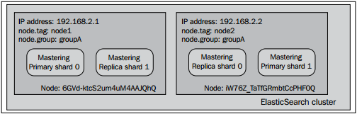
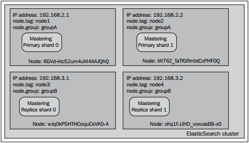

## 调整集群的分片分配

    
在<i>ElasticSearch Server</i>一书中，我们探讨了如何强制改变分片的分配方式，如何取消、如何使用一条API命令在集群中转移分片。然而在谈论到分片分配时，ElasticSearch允许我们做的不止如此，我们还可以定义以系列用于分片分配的规则。例如，假定一个4-节点的集群，图示如下：

    

正如你所看到的一样，集群由4个节点构成。每个节点都绑定了一个特定的IP地址，同时每个节点也拥有tag属性和group属性(可以在elasticsearch.yml文件中设置node.tag和node.group属性)。集群用来展示分片分配过滤器是如何工作的。group属性和tag属性可以用任意其它的名字替换，只需要把node作为自定义属性的前缀即可。比如你喜欢用属性名，party，就只需要把node.party:party1添加到你的elasticsearch.yml文件中即可。

<h4>Allocation awareness 配置</h4>

Allocation awareness制允许用户使用泛型参数来配置分片及分片副本的分配。为了演示allocation awareness的工作方式，我们使用我们的样例集群。为了集群的演示效果，我们在elasticsearch.yml文件中添加如下的属性：
<blockquote>cluster.routing.allocation.awareness.attributes:group</blockquote>

这条配置命令用来通知Elasticsearh使用node.group属性作为集群的awareness参数。

<!--note structure -->

  

	

	
设置cluster.routing.allocation.awareness.attributes属性的参数时，可以指定多个值。比如:
	<blockquote>cluster.routing.allocation.awareness.attributes:group,node </blockquote>
	

  

 <!-- end of note structure -->

参数设置好以后，我们先启动两个节点，两个节点的node.group值都是groupA，并且用如下的命令创建索引：
<blockquote style="text-indent:0em;">
curl&nbsp; -XPOST&nbsp; 'localhost:9200/mastering'&nbsp; -d&nbsp; '{
<blockquote>"settings" : {
"index" : {<blockquote>
"number\_of\_shards" : 2, 
"number\_of\_replicas" : 1</blockquote>
}
}</blockquote>
}'
</blockquote>

这个命令执行后，我们的2-节点集群看起来或多或少地类似于下面的图形：

 

正如所看见的那样，索引的分片平均分配到了两个节点中。现在，我们看看当启动剩下的两个节点时(node.group属性值设置为groupB)将会发生什么？

 

注意两者的不同点：主分片并没有从原来分配的节点中移出，反而是分片副本移动到了node.grooup值不同的节点中，这正是我们所希望的结果。在集群中使用了shard allocation awareness功能后，ElasticSearch不会把决定allocation awareness的属性(在本例中是node.group值)相同的分片或者分片副本分配到同一个节点中。该功能典型的用例是把集群拓扑结构部署到物理机或者虚拟机时，确保你的集群不会出现单点故障问题。

<!--note structure -->

  

	

	
请记住在使用allocation awareness功能时，分片不会被分配到没有设置相应属性的节点上。所在在我们的案例中，分片分配机制不会考虑分配分片到没有设置node.group属性的节点。
	

  

 <!-- end of note structure -->
<h4>Forcing allocation awareness</h4>
(文本的描述不并清晰，参考http://www.elasticsearch.org/guide/en/elasticsearch/reference/current/modules-cluster.html，一看就懂)

当我们事先知道awareness属性的取值范围并且不希望集群中有过多的分片副本时，使用forcing allocation awareness机制会很方便。比如，不希望集群中负载了过多的分片副本，我们可以强制allocation awareness只在有确定参数值时起作用。我们可以指定cluster.routing.allocation.awareness.force.zone.values属性的值，这是一个多值属性，多个值可以用逗号区分开来。比如，如果我们希望allocation awareness只在node.group属性的值为groupA和groupB生效时，我们可以在elasticsearch.yml文件中加入如下的代码：
<blockquote>
cluster.routing.allocation.awareness.attributes: group 
cluster.routing.allocation.awareness.force.zone.values: groupA, groupB
</blockquote>

<h4>过滤</h4>

ElasticSearch允许用户从整个集群或者索引的层面上配置allocation机制。在集群层面上配置allocation机制时，我们可以用如下的属性前缀：
<ul>
<li>cluster.routing.allocation.include</li>
<li>cluster.routing.allocation.require</li>
<li>cluster.routing.allocation.exclude</li>
</ul>
如果是在索引层面的分配，我们用如下的属性前缀：
<ul>
<li>index.routing.allocation.include</li>
<li>index.routing.allocation.require</li>
<li>index.routing.allocation.exclude</li>
</ul>
上面提到的前缀可以和elasticsearch.yml文件中定义的属性(tag属性和group属性)结合起来，而且还有一个命名为\_ip的属性允许用户匹配或者排除一些特定IP的节点。比如：
<blockquote>cluster.routing.allocation.include._ip:192.168.2.1</blockquote>
如果我们希望把group属性值为groupA的节点包括进来，我们可以设置如下的属性：
<blockquote>cluster.routing.allocation.include.group:groupA</blockquote>
注意我们使用cluster.routing.allocation.include属性的方式是以它为前缀并和其它属性的名字串联起来，在本例中是group属性。

<h4>include,exclude,required属性的意义</h4>

如果读者仔细观察了前面提到的参数，应该能注意到它们分为三种：
<ul>
<li>include:这种类型将导致所有定义了该参数的节点都会被包括进来。如果配置多种include的条件，那么在进行分片分配的时候，只要有一个条件满足，节点就会被allocation考虑进去。比如，如果我们在配置的cluster.routing.allocation.include.tag参数中中添加2个值：node1和node2，那么最终索引的分片会分配到第一个节点和第二个节点中(从左到右数)。总结一下：对于带有include allocation参数类型的结点，ElasticSearch会考虑把分片分配到该节点，但是并不意味着ElasticSearch一定会把分片分配到节点。</li>
<li>require:这个属性是ElasticSearch 0.90版本引入到allocation filter中去的。它需要节点的所有相关属性值都满足它设定的值。比如，如果我们往配置文件中添加cluster.routing.allocation.require.tag参数并设其值为node1，添加cluster.routing.allocation.require.group参数并设其值为groupA，最终所有的分片将会分配到第一个节点(IP值为192.168.2.1的节点)</li>
<li>exclude:这个属性允许我们在allocation过程中排除匹配属性值的节点。比如，如果我们设置cluster.routing.allocation.include.tag的值为groupA，最终我们的索引分片只会分配到IP值为192.168.3.1和192.168.3.2的节点上(例子中的第3和第4个节点)。</li>
</ul>

<!--note structure -->

  

	

	
属性值可以使用简单的正则表达式。比如，如果我们包含所有group属性中属性值以字符串group开头的结点，可以设置cluster.routing.allocation.include.group的值为group*。在我们的样例集群中，它会匹配到group参数值为groupA和groupB的节点。
	

  

 <!-- end of note structure -->
<h4>运行时allocation参数更新</h4>

