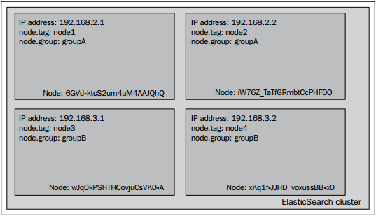

## 调整集群的分片分配

    
在<i>ElasticSearch Server</i>一书中，我们探讨了如何强制改变分片的分配方式，如何取消、如何使用一条API命令在集群中转移分片。然而在谈论到分片分配时，ElasticSearch允许我们做的不止如此，我们还可以定义以系列用于分片分配的规则。例如，假定一个4-节点的集群，图示如下：

    

正如你所看到的一样，集群由4个节点构成。每个节点都绑定了一个特定的IP地址，同时每个节点也拥有tag属性和group属性(可以在elasticsearch.yml文件中设置node.tag和node.group属性)。集群用来展示分片分配过滤器是如何工作的。group属性和tag属性可以用任意其它的名字替换，只需要把node作为自定义属性的前缀即可。比如你喜欢用属性名，party，就只需要把node.party:party1添加到你的elasticsearch.yml文件中即可。

<h4>分片分配感知方式的配置</h4>

分片分配感知机制允许用户使用泛型参数来配置分片及分片副本的分配。为了演示allocation awareness的工作方式，我们使用我们的样例集群。为了集群的演示效果，我们在elasticsearch.yml文件中添加如下的属性：
<blockquote>cluster.routing.allocation.awareness.attributes:group</blockquote>

这条配置语句用来通知Elasticsearh使用node.group属性作为集群的分片感知(awareness)参数。

