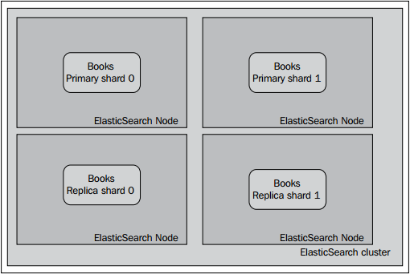

## 学以致用

随着第4章的慢慢接近尾声，我们需要获取一些接近我们日常工作的知识。因此，我们决定把一个真实的案例分成两个章节的内容。在本章节中，你将学到如何结合所学的知识，基于一些假设，构建一个容错的、可扩展的集群。由于本章主要讲配置相关的内容，我们也将聚焦集群的配置。也许结构和数据有所不同，但是对面同样的数据量集群处理检索需求的解决方案也许对你有用。

<h3>假设</h3>

在进入到纷繁的配置细节之前，我们来做一些假设，我们将基于这些假设来配置我们的ElasticSearch集群。

<h4>数据规模和检索性能需求</h4>

假设我们有一个在线图书馆，目前线上销售100,000种各种语言的书籍。我们希望查询请求的平均响应时间不高于200毫秒，这样就能避免用户在使用搜索服务时等待太长的时间，也能避免浏览器渲染页面时等待太长时间。所以，现在来实现期望负载。我们做了一些性能测试(内容超出本书的范围)，而且我们测到如下方案性能最好：给集群分配4个节点，数据切分到两个分片，而且每个分片挂载一个副本。

<!--note structure -->

  

	

	
读者也许想自己做一些性能测试。如果自己做，可以选择一些开源工具来模拟用户发送查询命令到集群中。比如，Apache JMeter(http://jmeter.apache.org/) 或者ActionGenerator((https://github.com/sematext/ActionGenerator) 。除此之外，还可以通过ElasticSearch提供的一些插件来查看统计记录，比如paramedic(https://github.com/karmi/elasticsearch-paramedic) ，或者BigDesk(https://github.com/lukas-vlcek/bigdesk) ，或者直接使用功能完善的监测和报警解决方案，比如Sematext公司开发，用于ElasticSearch的SPM系统(http://sematext.com/spm/elasticsearch-performancemonitoring/index.html) 。所有的这些工具都会提供性能测试的图示，帮助用户找到系统的瓶颈。除了上面提到的工具，读者可能还需要监控JVM垃圾收集器的工作以及操作系统的行为(上面提到的工具中有部分工具提供了相应的功能)。

  

 <!-- end of note structure -->

因此，我们希望我们的集群与下图类似：

当然，分片及分片副本真实的放置位置可能有所不同，但是背后的逻辑是一致的：即我们希望一节点一分片。

<h4>集群完整配置</h4>

接下来我们为集群创建配置信息，并详细讨论为什么要在集群中使用如下的属性：

<blockquote>
cluster.name: books
\# node configuration
node.master: true
node.data: true
node.max\_local\_storage\_nodes: 1
\# indices configuration
index.number\_of\_shards: 2
index.number\_of\_replicas: 1
index.routing.allocation.total\_shards\_per\_node: 1
\# instance paths
path.conf: /usr/share/elasticsearch/conf
path.plugins: /usr/share/elasticsearch/plugins
path.data: /mnt/data/elasticsearch
path.work: /usr/share/elasticsearch/work
path.logs: /var/log/elasticsearch
\# swapping
bootstrap.mlockall: true
\#gateway
gateway.type: local
gateway.recover\_after\_nodes: 3
gateway.recover\_after\_time: 30s
gateway.expected\_nodes: 4
\# recovery
cluster.routing.allocation.node\_initial\_primaries\_recoveries: 1
cluster.routing.allocation.node\_concurrent\_recoveries: 1
indices.recovery.concurrent_streams: 8
\# discovery
discovery.zen.minimum\_master\_nodes: 3
\# search and fetch logging
index.search.slowlog.threshold.query.info: 500ms
index.search.slowlog.threshold.query.debug: 100ms
index.search.slowlog.threshold.fetch.info: 1s
index.search.slowlog.threshold.fetch.debug: 200ms
\# JVM gargabe collection work logging
monitor.jvm.gc.ParNew.info: 700ms
monitor.jvm.gc.ParNew.debug: 400ms
monitor.jvm.gc.ConcurrentMarkSweep.info: 5s
monitor.jvm.gc.ConcurrentMarkSweep.debug: 2s
</blockquote>

接下来了解各个属性值的意义。

<h4>节点层面的配置</h4>

在节点层面的配置中，我们指定了一个集群名字(使用cluster.name属性)来标识我们的集群。如果在同一个网段中配置了多个集群，名字相同的节点会守护甜心连接成一个集群。接下来，这个特殊的节点会被选举成主节点(用node.master:true属性)，而且该节点可以容纳索引数据(node.data:true)。此外，通过设置node.max\_local\_storeage\_nodes属性值为1，可以限制一个节点上最多能够运行1个ElasticSearch实例。

<h4>索引的配置</h4>

由于我们只有一个索引，而且暂时也不打算添加更多的索引，我们决定设置分片的默认数量为2(用index.number\_of\_shards属性)，设置分片副本的默认数量为1(用index.number\_of\_replicas属性)。此外，我们还设置了index.routing.allocation.total\_shards\_per\_node属性值为1，这意味着对于每个索引，ElasticSearch只会在单个节点上分配一个分片。这应用到我们的4-节点集群的例子中就是每个节点会平均分配所有的分片。

<h4>各种目录的规划</h4>

我们已经把ElasticSearch安装到了/usr/share/elasticsearch目录，基于此，conf目录、plugins目录和工作目录都在该目录下。由于这个原因，我们把数据单独指定到硬盘的一个地方，这个地方就是/mnt/data/elasticsearch挂载点。最后，我们把日志文件安置到/var/log/elasticsearch目录。基于这样的目录规划，我们在做配置的更新操作时,只需要关注/usr/share/elasticsearch目录即可，无需接触其它的目录。

<h4>Gateway的配置</h4>

正如读者所了解的，gateway是负责存储索引和元数据的模块。在本例中，我们选择推荐的，也是唯一没有废弃的gateway类型，即local（gateway.type属性）。我们说我们希望当集群只有三个节点时,恢复进程就启动(gateway.recover\_after\_nodes属性)，同时至少3个节点相互连接30秒后开始恢复任务(用gateway.recover\_after\_time属性)。此外，我们还可以通过设置gateway.expected\_nodes属性值为4，用来通知ElasticSearch，我们的集群将由4个节点组成。

<h4>集群恢复机制</h4>

对于ElasticSearch来说，最核心的一种配置就是集群恢复配置。尽管它不是每天都会用到，正如你不会每天都重启ElasticSearch，也不希望集群经常失效一样。但是防范于未然是必须的。因此我们来讨论一下用到的相关属性。我们已经设置了 cluster.routing.allocation.node\_initial\_
primaries\_recoveries属性为1，这意味着我们只允许每个节点同时恢复一个主分片。这没有问题，因为每个服务器上只有一个节点。然而请记住这个操作基于gateway的local类型时会非常快，因此如果一个节点上有多个主分片时，不妨把这个值设置得大一点。 我们也设置了cluster.
routing.allocation.node\_concurrent\_recoveries属性值为1，再一次限制每个节点同时恢复的分片数量(我们的集群中每个节点只有一个分片，不会触发这条属性的红线，但是如果每个节点不止一个分片，而且系统I/O允许时，我们可以把这个值设置得稍微大一点)。此外，我们也设置了indices.recovery.concurrent\_streams属性值为8，这是因为在最初测试recovery过程时，我们了解到我们的网络 和服务器在从对等的分片中恢复一个分片时能够轻松地使用8个并发流，这也意味着我们可以同时读取8个索引文件。 

<h4>节点发现机制</h4>

在集群的discovery模块配置上，我们只需要设置一个属性：设置discovery.zen.minimum\_master\_nodes属性值为3。它指定了组成集群所需要的最少主节点候选节点数。这个值至少要设置成节点数的50%+1，在本例中就是3。它用来防止集群出现如下的状况：由于某些节点的失效，部分节点的网络连接会断开，并形成一个与原集群一样名字的集群(这种情况也称为“集群脑裂”状况)。这个问题非常危险，因为两个新形成的集群会同时索引和修改集群的数据。 

<h4>记录慢查询日志</h4>

使用ElasticSearch时有件事情可能会很有用，那就是记录查询命令执行过程中一段时间或者更长的日志。记住这种日志并非记录命令的整个执行时间，而是单个分片上的执行时间，即命令的部分执行时间。在本例中，我们用INFO级别的日志来记录执行时间长于500毫秒的查询命令以及执行时间长于1秒的real time get请求。在调试时，我们把这些值分别设置为100毫秒和200毫秒。如下的配置片段用于上述需求：
<blockquote>
index.search.slowlog.threshold.query.info: 500ms
index.search.slowlog.threshold.query.debug: 100ms
index.search.slowlog.threshold.fetch.info: 1s
index.search.slowlog.threshold.fetch.debug: 200ms
</blockquote>

<h4>记录垃圾回收器的工作日志</h4>

最后，由于我们的集群没有监控解决方案(至少刚开始没有)，我们想看到垃圾收集器的工作状态。说得更清楚一点，我们希望看到垃圾回收器是否花了太多的时间，如果是，是在哪个时间段。为了实现这一需求，我们在elasticsearch.yml文件中添加下面的信息：
<blockquote>
monitor.jvm.gc.ParNew.info: 700ms
monitor.jvm.gc.ParNew.debug: 400ms
monitor.jvm.gc.ConcurrentMarkSweep.info: 5s
monitor.jvm.gc.ConcurrentMarkSweep.debug: 2s
</blockquote>
在INFO级别的日志中，ElasticSearch会把运行时间太长的垃圾回收过程的相关信息记录下来，按照设置，阈值为 concurrent mark sweep收集器收集过程超过5秒，新生垃圾收集超过700毫秒。我们也添加了DEBUG级别的日志来应对debug需求和问题的修复。

<!--note structure -->

  

	

	
如果不清楚什么是新生代垃圾回收，或者不清楚什么是concurrent mark sweep，请参考Oracle的Java文档：http://www.oracle.com/technetwork/java/javase/
gc-tuning-6-140523.html. 

  

 <!-- end of note structure -->

<h4>内存设置</h4>

<h4>遗失的美好</h4>

还有一点没有提到，就是bootstrap.mlockall属性。该属性能够让ElasticSearch将堆内存锁住，并确保该块内存不会被操作系统替换成虚拟内存。如果把bootstrap.mlockall设置为true，推荐用户把ES\_MIN\_ME和ES\_MAX\_ME两个属性设置成相同的值。这样做可以确保服务器有足够的物理内存来启动ElasticSearch，并且保留足够的内存给操作系统让系统流畅运行。我们将在第6章<i>应对突发事件</i> 的 <i>避免Unix-like操作系统的swapping操作</i>一节中了解更多的相关知识。

<h4>量变引起质变</h4>

假定现在我们的服务做得很成功。访问的流量也逐步增长。而且，一家大公司希望跟我们合作。这家大的供应商不是卖自己的书，只是供货给零售商。预计该公司大概会上线200万种图书，所以系统需要处理的数据量将是现在的20倍(只估算索引文档的数量)。我们必须为这些变化作准备，也就是说要更改我们的ElasticSearch集群，使我们的用户体验能够得到保持甚至提升现。我们需要做什么呢？ 

