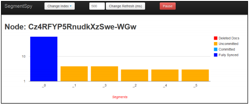

## 索引段数据的统计

在<i>第3章 索引底层控制</i>中 <i>控制段合并</i> 一节中，我们探讨了调整Apache Lucene索引段合并过程来满足业务需求的可能性。此外，在<i>第6章 应对突发事件</i>的<i>当I/O过于繁忙——节流功能详解</i>一节中，我们将讨论更多功能的参数配置。然而，为了了解需要调整哪些方面，至少先得看看索引或者索引分片中索引段的结构。 

<h4>段操作相关的API介绍</h4>

为了更深入地了解Lucene的索引段，ElasticSearch提供了段操作相关的API，通过在执行的HTTP GET请求中附带\_segments REST端点，就可以调用相关的API了。比如，我们想了解集群分片中的所有的段信息，可以执行如下的命令：
<blockquote>curl -XGET 'localhost:9200/_segments'</blockquote>
如果想查看mastering索引的段信息，就应该执行如下的命令：
<blockquote>curl -XGET 'localhost:9200/mastering/_segments'</blockquote>
我们也可以同时查看多个索引的段信息，通过如下的命令即可：
<blockquote>curl -XGET 'localhost:9200/mastering,books/_segments'</blockquote>

<h4>返回信息</h4>

调用segments API的返回信息都是基于分片的。这是因为我们的索引都是由一个或多个分片(以及分片副本)组成，而且众所周知每个分片都是一个完整的Apache Lucene的物理索引。我们假定我们有一个名为mastering的索引，而且索引中有一些文档。在索引创建时，我们已经指定索引由单个分片构成，而且没有分片副本：由于只是用于测试的索引，这样做没有什么问题。我们来看一下，执行如下的命令后，索引段信息会是什么样：
<blockquote>curl -XGET 'localhost:9200/_segments?pretty'</blockquote>
返回的JSON格式信息如下(有部分删减)：
<blockquote>
{
"ok" : true,
"_shards" : {
"total" : 1,
"successful" : 1,
"failed" : 0
},
"indices" : {
"mastring" : {
"shards" : {
"0" : [ {
"routing" : {
"state" : "STARTED",
"primary" : true,
"node" : "Cz4RFYP5RnudkXzSwe-WGw"
},
"num\_committed\_segments" : 1,
"num\_search\_segments" : 8,
"segments" : {
"_0" : {
"generation" : 0,
"num_docs" : 62,
"deleted_docs" : 0,
"size" : "5.7kb",
"size\_in\_bytes" : 5842,
"committed" : true,
"search" : true,
"version" : "4.3",
"compound" : false
},
...
"_7" : {
"generation" : 7,
"num_docs" : 1,
"deleted_docs" : 0,
"size" : "1.4kb",
"size\_in_bytes" : 1482,
"committed" : false,
"search" : true,
"version" : "4.3",
"compound" : false
}
}
} ]
}
}
}
}
</blockquote>
我们可以看到，ElasticSearch返回了大量可供分析的信息。最顶层的息是索引名称和和分片。在本例中，通过返回信息可以看到，我们有一个编号为0的分片，该分片已经启动而且正在运行("state" : "STARTED" ) ，该分片是一个主分片 ("primary" : true) ,该分片位于id为 Cz4RFYP5RnudkXzSwe-WGw的节点上。接下来的信息是关于已提交段的数量(通过num\_commited\_segments属性)和搜索段的数量(num\_search\_segments属性)。已提交段表示该段上面运行了一个提交的命令，即段数据已经持久化到硬盘，而且是只读的了。搜索段即可用于搜索的段。接下来是一系列的段信息，每个段中包含的信息如下：
<ul>
<li>number:该属性为段指定了一个编号，作为多个段分组时得到的JSON对象的名称。(比如，\_0,\_1,等等)</li>
<li>generation:该属性指定的段在索引中属于第几代，用一个整数来表示段的“老年化”程度。比如，第一个创建的段就是第0代，随后创建的段就是第1代，以此类推。</li>
<li>num_docs:该属性表明该段中索引的文档数。</li>
<li>deleted_docs:该属性表示该段中被标记为删除的文档数。这些标记为删除的文档将在段合并的时候被真正地删除。</li>
<li>size:该属性表明段在硬盘上占用的空间大小。</li>
<li>size\_in\_bytes:该属性表明段的大小用byte来表示时的数值。</li>
<li>committed: 如果段已经提交，则该属性值为true；否则该属性值为false.</li>
<li>search:该属性表示可搜索段的个数。</li>
<li>version:该属性表示创建索引时使用的Lucene的版本。边注：尽管每个特定版本的ElasticSearch都只使用特定版本的Lucene，但是也是可能发生不同的索引段由不同的Lucene版本创建这一情况。像升级ElasticSearch版本，而且正好两个版本的ElasticSearch使用了不同版本的Lucene时，就会出现上面的情况。面对这种情况，旧版本的索引段会在索引合并操作时进行重写操作。</li>
<li>compound:该属性指定了段的格式是否是组合的(所有的段信息都存储在一个文件)</li>
</ul>

<h4>段信息可视化</h4>

当看到segments API返回的JSON格式的文本信息时，我们大脑中冒出的第一个想法可能是：如果信息是可视化的，那就很直观明了了。如果想实现这种想法，随时可以自己去做。现在已经有一个现成的名为SegmentSpy的插件(https://github.com/polyfractal/elasticsearch-segmentspy )利用我们前面提到的API实现了段信息的可视化功能。

安装该插件后，将Web浏览器指向到http://localhost:9200/_plugin/segmentspy/ ，然后选择目标索引，我们就可以看到类似如下的屏幕截图

 

正如读者所见，该插件将segments API返回的信息进行了可视化的操作，这样的话想查看段信息时就能够用得上了。只是该插件没有解析ElasticSearch返回的JSON对象中的所有信息。 

